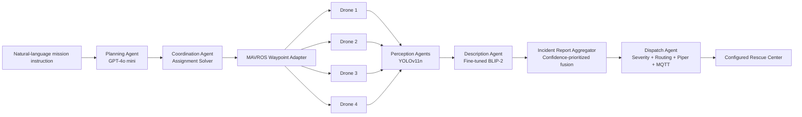

# Multi-Drone Accident Management

**An agentic multi-drone framework for autonomous multi-accident detection, reasoning, coordination, and emergency-response dispatch.**

[](LICENSE)
[](requirements.txt)


[](https://doi.org/10.5281/zenodo.22808434)

This repository implements the system described in:

> **An Agentic Multi-Drone Framework for Autonomous Multi-Accident Detection, Reasoning, and Response**  
> Afaq Ahmed, Hassan Eesaar, Muhammad Farhan, YongSuk Yoo, and Deok Jin Lee  
> Jeonbuk National University

The framework combines five functional agents **planning, coordination, per-drone perception, scene description, and dispatch** with ROS/MAVROS integration for multi-drone accident-response experiments.

The complete closed-loop multi-agent system was evaluated in a four-drone/four-incident Gazebo configuration. Physical DJI M30T experiments were preliminary and limited to perception/scene-description evaluation; they did **not** reproduce the full planning, coordination, dispatch, and autonomous-control loop on the physical platform.

---

## Table of Contents

- [Architecture](#architecture)
- [Repository Structure](#repository-structure)
- [Installation](#installation)
- [Quick Start](#quick-start)
- [Connected ROS/MAVROS Pipeline](#connected-rosmavros-pipeline)
- [Agent-by-Agent Guide](#agent-by-agent-guide)
- [Dataset and Training Data](#dataset-and-training-data)
- [Results](#results)
- [Testing](#testing)
- [Reproducibility Scope and Limitations](#reproducibility-scope-and-limitations)
- [Status](#status)
- [Code and Data Availability](#code-and-data-availability)
- [Citation](#citation)
- [License](#license)

---

## Architecture

The system is organized around five functional agents. The repository also contains lightweight ROS/MAVROS adapter and aggregation nodes that connect the agents into an executable modular pipeline.



| # | Agent | Role | Code |
|---|---|---|---|
| 1 | **Planning** | Extracts structured waypoint/incident information from natural-language mission instructions using GPT-4o mini | [`planning_agent/`](planning_agent/) |
| 2 | **Coordination** | Solves the one-to-one drone-to-incident assignment problem and publishes per-drone assignments/waypoints | [`coordination_agent/`](coordination_agent/) |
| 3 | **Perception** (×N) | Runs per-drone YOLOv11n accident/fire detection and spatial event deduplication | [`perception_agent/`](perception_agent/) |
| 4 | **Description** | Generates BLIP-2 incident captions and supports confidence-prioritized multi-view fusion | [`description_agent/`](description_agent/) |
| 5 | **Dispatch** | Computes severity, selects a rescue center, synthesizes Piper audio, and publishes alerts through the configured MQTT broker | [`dispatch_agent/`](dispatch_agent/) |

The MAVROS waypoint adapter, report aggregator, and ROS dispatch wrapper are integration components rather than additional reasoning agents.

---

## Repository Structure

```text
Multi_Drone_Accident_Management/
│
├── Yolov11n_Model_Weights/
│   ├── best.pt
│   └── last.pt
│
├── planning_agent/
│   ├── prompt_templates/
│   │   └── system_prompt.txt
│   └── llm_waypoint_node.py
│
├── coordination_agent/
│   ├── assignment_solver.py
│   ├── coordination_node.py
│   └── mavros_waypoint_adapter.py
│
├── perception_agent/
│   ├── train_yolov11n.py
│   ├── inference_node.py
│   └── weights/
│       └── README.md
│
├── description_agent/
│   ├── finetune_blip2.py
│   ├── fusion.py
│   ├── inference.py
│   └── report_aggregator.py
│
├── dispatch_agent/
│   ├── rescue_center_router.py
│   ├── tts_dispatch.py
│   └── ros_dispatch_node.py
│
├── dataset_finetuning/
│   ├── prepare_dataset.py
│   └── generate_captions_moondream2.py
│
├── video_inference/
│   └── youtube_video_test.py
│
├── model/
│   ├── config.py
│   └── utils.py
│
├── tests/
│
├── docs/
│
├── requirements.txt
├── environment.yml
├── LICENSE
└── README.md
```

Gazebo worlds and UAV model files are **not distributed** in this repository. Users may connect the agent layer to their own compatible Gazebo/ArduPilot/MAVROS vehicle configuration using the documented ROS interfaces.

---

## Installation

### Option A — pip

```bash
git clone https://github.com/afaq005/Multi_Drone_Accident_Management.git
cd Multi_Drone_Accident_Management

python3 -m venv .venv
source .venv/bin/activate

pip install -r requirements.txt
```

### Option B — conda

```bash
conda env create -f environment.yml
conda activate mdam
```

### ROS / Gazebo / MAVROS / ArduPilot

The closed-loop integration assumes a ROS/MAVROS setup providing, for each drone namespace:

```text
/droneN/mavros/local_position/pose
/droneN/mavros/setpoint_position/local
/droneN_camera/image_raw
```

The repository does not assume a particular Gazebo world or UAV model.

The current ROS coordination/control path uses **local Cartesian coordinates**. Geographic GPS coordinates are supported by standalone routing/assignment utilities where explicitly selected, but the demonstrated MAVROS waypoint adapter consumes local position setpoints.

### Environment variables

```bash
export OPENAI_API_KEY="sk-..."

export MDAM_YOLO_WEIGHTS="Yolov11n_Model_Weights/best.pt"

export MDAM_BLIP2_WEIGHTS="/path/to/blip2_finetuned"

export MDAM_PIPER_VOICE="/path/to/en_US-libritts-high.onnx"

export MDAM_MQTT_HOST="localhost"
export MDAM_MQTT_PORT="1883"
export MDAM_MQTT_TOPIC="emergency/alerts"
```

Shared defaults are defined in [`model/config.py`](model/config.py).

---

## Quick Start

Each major component can be exercised independently without launching the complete ROS/Gazebo stack.

### 1. Planning agent

Parse one natural-language mission instruction:

```bash
python planning_agent/llm_waypoint_node.py \
  --transcript "Fly drone 1 to (-165, -1.43, 10), drone 2 to (102.2, 4.1, 10)."
```

The planning agent accepts the historical per-drone waypoint JSON representation as well as the normalized incident representation used by the current pipeline.

Stable `mission_id` and `incident_id` values are generated by software after model parsing rather than being generated by the language model.

### 2. Coordination agent

Run the assignment solver directly:

```bash
python coordination_agent/assignment_solver.py \
  --coordinate-mode local \
  --incidents '[{"lat":-165,"lon":-1.43,"alt":10},{"lat":102.2,"lon":4.1,"alt":10}]'
```

In local mode, the historical `lat` and `lon` schema fields represent local `x` and `y` coordinates for backward compatibility with the original pipeline schema.

### 3. Perception agent

Run YOLOv11n on a video:

```bash
python perception_agent/inference_node.py \
  --namespace /drone1 \
  --source accident_clip.mp4
```

The default trained checkpoint is:

```text
Yolov11n_Model_Weights/best.pt
```

### 4. Description agent

Caption one image:

```bash
python description_agent/inference.py \
  --image detected_frame.jpg
```

### 5. Dispatch agent — GPS mode

```bash
python dispatch_agent/tts_dispatch.py \
  --type accident \
  --summary "Head-on collision, no visible fire." \
  --coordinate-mode gps \
  --lat 37.33445 \
  --lon -122.00898 \
  --conf 0.87 \
  --log-p-blip2 -0.4
```

### 6. Dispatch agent — local Cartesian mode

Local routing requires rescue-center coordinates defined in the **same local coordinate frame** as the incident.

Example `local_rescue_centers.json`:

```json
[
  ["Rescue Center A", -150.0, 20.0],
  ["Rescue Center B", 80.0, 15.0]
]
```

Then run:

```bash
python dispatch_agent/tts_dispatch.py \
  --type accident \
  --summary "Head-on collision." \
  --coordinate-mode local \
  --x -165 \
  --y -1.43 \
  --centers-json local_rescue_centers.json \
  --conf 0.87 \
  --log-p-blip2 -0.4
```

The default rescue-center entries in `model/config.py` are geographic examples and are never silently interpreted as local Gazebo coordinates.

---

## Connected ROS/MAVROS Pipeline

The integrated repository pipeline is:

```text
/llm_waypoint_request
        ↓
Planning Agent
        ↓
/planning_agent/incidents
        ↓
Coordination Agent
        ├── /droneN/assigned_incident
        └── /droneN/waypoints
                    ↓
          MAVROS Waypoint Adapter
                    ↓
/droneN/mavros/setpoint_position/local
                    ↓
             ArduPilot / UAV
                    ↓
       /droneN_camera/image_raw
                    ↓
           Perception Agent
                    ↓
/droneN/yolo_detection/event
                    ↓
          Description Agent
                    ↓
 /description_agent/view_report
                    ↓
       Report Aggregator
                    ↓
 /description_agent/fused_report
                    ↓
        ROS Dispatch Node
          ├── Piper TTS
          ├── MQTT broker
          └── /dispatch_agent/alert
```

### Start the planning node

```bash
python planning_agent/llm_waypoint_node.py
```

It subscribes to:

```text
/llm_waypoint_request
```

and publishes:

```text
/planning_agent/incidents
```

### Start the coordination node

```bash
python coordination_agent/coordination_node.py
```

For each assigned drone it publishes:

```text
/droneN/assigned_incident
/droneN/waypoints
```

### Start one MAVROS waypoint adapter per drone

Example:

```bash
python coordination_agent/mavros_waypoint_adapter.py \
  --namespace /drone1
```

The adapter continuously streams the active target to:

```text
/drone1/mavros/setpoint_position/local
```

Automatic arming and `GUIDED`-mode requests are disabled by default. They can be enabled explicitly in an appropriate controlled environment:

```bash
python coordination_agent/mavros_waypoint_adapter.py \
  --namespace /drone1 \
  --set-guided \
  --auto-arm
```

Vehicle arming/mode behavior remains deployment-specific.

### Start one perception node per drone

```bash
python perception_agent/inference_node.py \
  --namespace /drone1
```

A persisted event is sent downstream only when valid incident-assignment metadata is available.

### Start one description node per drone

```bash
python description_agent/inference.py \
  --ros \
  --namespace /drone1
```

Each node publishes a structured report on:

```text
/description_agent/view_report
```

### Start the incident report aggregator

```bash
python description_agent/report_aggregator.py \
  --ros
```

The default collection window is 1.0 s and can be changed with:

```bash
--fusion-window <seconds>
```

The aggregator publishes:

```text
/description_agent/fused_report
```

If several views carry the same `incident_id`, confidence-prioritized fusion is applied. If only one report is available, the same interface produces a single-view consolidated report.

### Start the ROS dispatch node

For a local Cartesian simulation:

```bash
python dispatch_agent/ros_dispatch_node.py \
  --centers-json local_rescue_centers.json
```

It publishes the final routed ROS representation on:

```text
/dispatch_agent/alert
```

and separately attempts Piper audio synthesis and delivery to the configured MQTT broker.

MQTT publication represents delivery to the configured broker; it should not be interpreted as direct integration with a real emergency-service network.

---

## Agent-by-Agent Guide

### Planning Agent

[`planning_agent/`](planning_agent/)

The planning agent calls GPT-4o mini with `temperature=0` and a constrained system prompt.

Its function in the evaluated workflow is **structured waypoint/incident extraction from natural-language mission instructions**, rather than unrestricted emergency reasoning.

Two forms are supported:

**Operator-directed waypoint mapping**

```json
{
  "/drone1/waypoints": [
    [-165.0, -1.43, 10.0]
  ]
}
```

and the normalized representation:

```json
{
  "incidents": [
    {
      "lat": -165.0,
      "lon": -1.43,
      "alt": 10.0,
      "drone": "/drone1",
      "coordinate_mode": "local"
    }
  ],
  "coordinate_mode": "local"
}
```

Software-generated mission and incident identifiers are added after the language-model response.

Malformed responses, unavailable API credentials, and schema failures result in a graceful non-actionable payload rather than malformed downstream commands.

---

### Coordination Agent

[`coordination_agent/`](coordination_agent/)

The coordination layer solves the one-to-one drone-to-incident assignment problem using:

```text
scipy.optimize.linear_sum_assignment
```

with a greedy nearest-neighbor fallback when SciPy is unavailable.

The current mathematical formulation requires:

```text
number of incidents K ≤ number of drones N
```

because each incident is assigned exactly one drone and each drone is assigned at most one incident in a single assignment round.

`K > N` is therefore explicitly rejected rather than silently padded or treated as solved.

The current ROS coordination node uses:

```text
/droneN/mavros/local_position/pose
```

and consequently accepts local Cartesian mission coordinates only.

The standalone assignment solver also supports GPS/Haversine distance when GPS coordinates are explicitly selected.

---

### MAVROS Waypoint Adapter

[`coordination_agent/mavros_waypoint_adapter.py`](coordination_agent/mavros_waypoint_adapter.py)

This integration component converts generic coordination-agent `PoseArray` waypoint outputs into continuous MAVROS local-position setpoints.

Input:

```text
/droneN/waypoints
```

Vehicle pose:

```text
/droneN/mavros/local_position/pose
```

Output:

```text
/droneN/mavros/setpoint_position/local
```

The adapter advances through the waypoint list when the vehicle reaches the current target within the configured tolerance.

It does not require or distribute a particular Gazebo world/UAV model.

---

### Perception Agent

[`perception_agent/`](perception_agent/)

The perception stage trains and runs YOLOv11n on the two-class:

```text
0 = accident
1 = fire
```

dataset.

The inference node implements:

- confidence threshold `τ = 0.5`;
- a rolling detected-frame window;
- spatial event deduplication using a 10 m displacement threshold;
- assignment-aware event metadata;
- reset of deduplication state when a drone receives a new incident assignment.

The bundled default checkpoint is:

```text
Yolov11n_Model_Weights/best.pt
```

Its recorded training configuration includes:

```text
Ultralytics: 8.3.50
base model: yolo11n.pt
maximum epochs: 200
early-stopping patience: 100
batch size: 16
image size: 640
seed: 0
AMP: enabled
optimizer: auto
```

The device index recorded in the original checkpoint is hardware-specific and is intentionally not forced by the reproduction script.

Ultralytics' online training augmentation is applied in addition to the pre-generated training-set augmentation described below.

---

### Description Agent

[`description_agent/`](description_agent/)

The description model uses:

```text
Salesforce/blip2-opt-2.7b
```

During the repository's task-specific fine-tuning configuration:

- the vision encoder is frozen;
- the Q-Former is frozen;
- the language projection remains trainable;
- the OPT language-generation model remains trainable;
- trainable components use conditional-generation cross-entropy loss.

The inference node reports the mean token log-likelihood of the selected generated sequence for downstream severity computation.

#### Confidence-prioritized fusion

[`description_agent/fusion.py`](description_agent/fusion.py) does **not** combine BLIP probability distributions.

For views `i`, normalized confidence weights are:

```text
w_i = c_i / Σ_k c_k
```

The highest-confidence view supplies the primary caption. Secondary captions are inspected in confidence order, and non-duplicated salient information may be appended.

The heuristic fused sentence is not assigned an artificial BLIP probability. Downstream severity calculation uses the primary view's actual mean token log-likelihood.

---

### Incident Report Aggregator

[`description_agent/report_aggregator.py`](description_agent/report_aggregator.py)

This ROS integration node groups description reports by:

```text
incident_id
```

and publishes one consolidated report on:

```text
/description_agent/fused_report
```

Multiple reports for the same incident can be fused. The default one-drone-per-incident assignment formulation, however, ordinarily produces one primary assigned view per incident unless additional views carrying the same `incident_id` are supplied.

---

### Dispatch Agent

[`dispatch_agent/`](dispatch_agent/)

The dispatch stage computes the severity score:

```text
severity = sigmoid(
    α × YOLO confidence
    + β × BLIP-2 mean token log-likelihood
)
```

For fused reports, both severity inputs come from the same highest-confidence primary view.

Routing supports:

```text
GPS coordinates
    → Haversine distance

Local Cartesian coordinates
    → Euclidean distance
```

Local routing requires explicit rescue-center coordinates in the same coordinate frame. Default GPS rescue-center examples cannot silently be reused as local coordinates.

The dispatch stage can:

- construct the structured alert;
- select the nearest configured rescue center;
- synthesize an audio message with Piper;
- publish JSON through MQTT;
- publish the routed alert on `/dispatch_agent/alert`.

---

## Dataset and Training Data

Two derived datasets are used.

| Dataset | Purpose | Size |
|---|---|---:|
| YOLO detection dataset | Accident/fire object detection | 2,548 manually curated base images → 1,783 train / 511 validation / 254 test before augmentation; training-only offline augmentation expands training to 3,566 images, for 4,331 derived images total |
| BLIP-2 fine-tuning pairs | Incident-caption generation | 1,783 train / 511 validation / 254 test image-caption pairs |

### Source data

The curated base pool combines:

1. Roboflow accident dataset: [`donghee/test-d95ea`](https://universe.roboflow.com/donghee/test-d95ea)
2. Roboflow car-fire dataset: [`kk-qg4vu/car-fires-detection`](https://universe.roboflow.com/kk-qg4vu/car-fires-detection)
3. Images from the authors' previous study: [Ahmed et al., 2024](https://doi.org/10.3390/drones8120741)

Source images retain their original platform/publication licensing terms and are not redistributed directly in this repository.

### Important dataset-preparation scope

`dataset_finetuning/prepare_dataset.py` reproduces the reported:

```text
curated base pool
        ↓
split before augmentation
        ↓
train / validation / test
        ↓
augment training partition only
```

workflow **once the manually curated and class-harmonized 2,548-image input pool is supplied**.

The script does not reconstruct the manual image-selection decisions from arbitrary raw source downloads.

It also assumes source YOLO labels have already been harmonized to:

```text
0 = accident
1 = fire
```

and copies those class IDs into the compiled dataset.

### Reported split

```text
Base pool:   2,548 images

Train:       1,783
Validation:    511
Test:          254
```

Offline augmentation is applied only after splitting:

```text
Augmented train: 3,566
Validation:        511
Test:              254

Derived YOLO total: 4,331
```

This prevents augmented versions of the same base image from crossing into validation or test partitions.

### Prepare the detection dataset

```bash
python dataset_finetuning/prepare_dataset.py \
  --sources roboflow_accident/ roboflow_fire/ previous_study/ \
  --output dataset_finetuning/compiled \
  --augment
```

### Generate BLIP-2 caption pairs

Training:

```bash
python dataset_finetuning/generate_captions_moondream2.py \
  --split-dir dataset_finetuning/compiled/train/images \
  --output dataset_finetuning/blip2_data/train.jsonl
```

Validation and test can be generated analogously.

By default, filenames containing `_aug_` are excluded from caption generation. Therefore the BLIP-2 training set uses the 1,783 original training images rather than the 3,566-image augmented YOLO training partition.

The caption files store image locations relative to the JSONL file to improve archive portability.

### Synthetic reference captions

The BLIP-2 training/evaluation reference captions were generated using `moondream2`.

Consequently, the reported text-generation metrics measure agreement with these **synthetic reference descriptions**, not agreement with independently authored expert human captions. This distinction should be considered when interpreting BLEU, ROUGE-L, METEOR, CIDEr, and SPICE values.

---

## Results

The values below reproduce the manuscript's reported experimental tables. They should not be interpreted as newly rerun benchmark results from every current repository configuration.

### YOLO model comparison

| Model | mAP@50 (All) | Recall (All) | Inference (ms) | Params (M) | GFLOPs |
|---|---:|---:|---:|---:|---:|
| YOLOv12n | 0.841 | 0.770 | 3.1 | 2.55 | 6.3 |
| **YOLOv11n** | **0.874** | **0.826** | 2.2 | 2.58 | **6.3** |
| YOLOv10n | 0.852 | 0.722 | 2.7 | 2.69 | 8.2 |
| YOLOv9t | 0.841 | 0.777 | 2.8 | 1.97 | 7.6 |
| YOLOv8n | 0.860 | 0.803 | 1.9 | 3.01 | 8.1 |

### Fine-tuned BLIP-2

Evaluation set: 254 synthetic-reference image-caption pairs.

| BLEU-4 | ROUGE-L | METEOR | CIDEr | SPICE |
|---:|---:|---:|---:|---:|
| 11.70 | 30.12 | 35.05 | 45.05 | 21.42 |

### BLIP-2 vs. SmolVLM inference-time comparison

| Case | SmolVLM (s) | BLIP-2 fine-tuned (s) |
|---|---:|---:|
| Accident 1 | 3.63 | 1.413 |
| Accident 2 | 3.59 | 1.349 |
| Fire 1 | 3.27 | 1.912 |
| Fire 2 | 3.76 | 1.413 |

### Original end-to-end timing experiment

The manuscript reports a median end-to-end latency of approximately:

```text
7.7 s
```

for the **original evaluated four-drone simulation configuration**.

| Stage | Median (ms) |
|---|---:|
| GPT-4o mini waypoint extraction | 620 |
| ROS topic propagation | 30 |
| Take-off and cruise to first waypoint | 5900 |
| YOLO inference | 38 |
| Fine-tuned BLIP-2 caption | 1100 |
| MQTT push | 8 |

Approximately 5.9 s of the reported 7.7 s was simulated vehicle travel time.

These figures are configuration- and hardware-specific. They should not be treated as fresh timing measurements for the expanded repository integration wrappers.

In particular, `report_aggregator.py` uses a configurable report-collection window with a default of 1.0 s. That integration delay was not retroactively included in the original reported latency.

---

## Testing

Install and run:

```bash
pip install pytest
pytest tests/ -v
```

The repository tests exercise core deterministic components including:

- assignment-solver behavior;
- explicit operator assignments;
- invalid/infeasible assignment cases;
- local and GPS distance handling;
- confidence-prioritized caption fusion;
- severity computation;
- rescue-center routing;
- local-coordinate routing safeguards.

The additional ROS/Gazebo/ArduPilot, OpenAI API, BLIP-2 model inference, Piper, and live MQTT paths require their corresponding external runtime dependencies and services.

For syntax checking:

```bash
python -m compileall -q .
```

---

## Reproducibility Scope and Limitations

The repository is intended to expose the study's custom pipeline and make its interfaces and deterministic components reproducible. Several scope boundaries are important.

### Simulation environment

The repository does not distribute a fixed Gazebo world, UAV model, or complete ArduPilot/SITL environment.

Users provide a compatible vehicle/simulation setup exposing the required MAVROS and camera topics.

### Four-drone closed-loop evaluation

The reported complete closed-loop experiment used four drones and four incidents.

The code permits other `K ≤ N` one-to-one assignments, but the paper does not report an exhaustive scalability study over arbitrary fleet sizes.

### `K > N`

The current one-round assignment formulation requires one unique drone per incident and at most one incident per drone.

Therefore:

```text
K > N
```

is infeasible under the implemented formulation and is explicitly rejected.

Sequential servicing, dynamic task queues, and reassignment after vehicle failure are future extensions rather than demonstrated capabilities of the current implementation.

### Multi-view fusion

The fusion/aggregation implementation can combine several description reports carrying the same `incident_id`.

However, the default one-drone-per-incident assignment does not itself guarantee multiple simultaneous drone views of every incident.

### Physical M30T evaluation

Physical DJI M30T experiments were limited to preliminary perception and scene-description evaluation.

They should not be interpreted as a physical reproduction of the complete GPT planning → assignment → autonomous flight → dispatch pipeline.

### BLIP-2 references

BLIP-2 text metrics use `moondream2`-generated synthetic references. They quantify agreement with those references rather than independent human-expert descriptions.

### Integration-wrapper timing

`mavros_waypoint_adapter.py`, `report_aggregator.py`, and `ros_dispatch_node.py` make the archived software pipeline more explicit and executable.

Do not assume that latency introduced by every current integration wrapper was included in the originally reported 7.7-s measurement unless the timing experiment is rerun using the current archived configuration.

---

## Status

| Component | Status |
|---|---|
| GPT-4o mini planning agent | ✅ Implemented |
| Hungarian/greedy coordination solver | ✅ Implemented |
| Stable mission/incident metadata | ✅ Implemented |
| ROS assignment + waypoint publishing | ✅ Implemented |
| MAVROS local-position waypoint adapter | ✅ Implemented |
| YOLOv11n training/inference | ✅ Implemented |
| Trained YOLOv11n checkpoint | ✅ Included |
| Assignment-aware perception events | ✅ Implemented |
| BLIP-2 fine-tuning/inference | ✅ Implemented |
| Confidence-prioritized fusion | ✅ Implemented |
| Incident report aggregator | ✅ Implemented |
| GPS/local rescue-center routing | ✅ Implemented |
| Piper/MQTT dispatch | ✅ Implemented |
| ROS dispatch wrapper | ✅ Implemented |
| Dataset split/augmentation scripts | ✅ Implemented |
| Fixed Gazebo world / UAV model | Not distributed; user supplied |
| Fine-tuned BLIP-2 checkpoint | Reproducible via provided script; not bundled |
| Dynamic failure reassignment | Not implemented |
| General `K > N` sequential servicing | Not implemented |

---

## Code and Data Availability

The custom code developed for this study, including the agent implementations, ROS/MAVROS integration, and training/evaluation scripts, is available in this GitHub repository:

https://github.com/afaq005/Multi_Drone_Accident_Management

A permanent archived version is available through Zenodo:

https://doi.org/10.5281/zenodo.22808434

The repository/archive contains:

- custom agent implementations;
- ROS/MAVROS integration code;
- dataset preparation and caption-generation scripts;
- training/evaluation scripts;
- the fine-tuned YOLOv11n detection checkpoint.

The curated dataset combines public-source images with images from the authors' previous study. Source images remain subject to their respective licenses and are not redistributed directly.

The fine-tuned BLIP-2 checkpoint can be reproduced using the provided fine-tuning scripts and prepared image-caption data.

---

## Citation

```bibtex
@article{ahmed2026agentic,
  title   = {An Agentic Multi-Drone Framework for Autonomous Multi-Accident Detection, Reasoning, and Response},
  author  = {Ahmed, Afaq and Eesaar, Hassan and Farhan, Muhammad and Yoo, YongSuk and Lee, Deok Jin},
  journal = {Preprint},
  year    = {2026}
}
```

Update the bibliographic entry with the final journal volume/article information after publication.

For the archived code:

```text
Zenodo DOI: 10.5281/zenodo.22808434
```

---

## License

Repository source code is released under the [MIT License](LICENSE).

External datasets, pretrained foundation models, model-derived artifacts, and third-party software retain their respective upstream terms and licenses.

The bundled YOLOv11n checkpoint was produced using Ultralytics software and should be used in accordance with the applicable upstream Ultralytics licensing terms.

Public-source dataset images are not redistributed directly by this repository.
