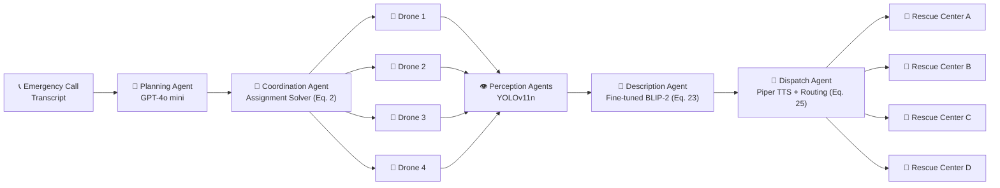

#  Multi-Drone Accident Management

**An agentic, end-to-end multi-drone framework for autonomous highway accident detection, reasoning, and emergency response.**

[](LICENSE)
[](requirements.txt)
[](simulation/)
[](simulation/worlds)

This repository implements the system described in:

> *An Agentic Multi-Drone Framework for Autonomous Multi-Accident Detection, Reasoning, and Response*
> Afaq Ahmed, Hassan Eesaar, Muhammad Farhan, YongSuk Yoo, Deok Jin Lee — Jeonbuk National University

Five autonomous, communicating agents — **planning, coordination, per-drone perception, scene description, and dispatch** — jointly reason over, allocate, and respond to multiple simultaneous highway accidents without step-by-step human supervision, validated in Gazebo and on a physical M30T drone.

---

## Table of Contents
- [Architecture](#architecture)
- [Repository Structure](#repository-structure)
- [Installation](#installation)
- [Quick Start](#quick-start)
- [Agent-by-Agent Guide](#agent-by-agent-guide)
- [Dataset](#dataset)
- [Results](#results)
- [Running the Full Simulation](#running-the-full-simulation)
- [Testing](#testing)
- [Status / What's Implemented](#status--whats-implemented)
- [Citation](#citation)
- [License](#license)

---

## Architecture

The system decomposes into five autonomous agents communicating over ROS/MQTT (Eq. 1 of the paper):



| # | Agent | Role | Code |
|---|---|---|---|
| 1 | **Planning** | Parses free-form emergency-call transcripts into structured coordinates + intent via GPT-4o mini | [`planning_agent/`](planning_agent/) |
| 2 | **Coordination** | Solves the optimal drone-to-incident assignment problem (Eq. 2) | [`coordination_agent/`](coordination_agent/) |
| 3 | **Perception** (×N) | Per-drone real-time YOLOv11n accident/fire detection (Eq. 21-22) | [`perception_agent/`](perception_agent/) |
| 4 | **Description** | Fine-tuned BLIP-2 scene captioning + multi-view confidence-weighted fusion (Eq. 18-20, 23) | [`description_agent/`](description_agent/) |
| 5 | **Dispatch** | Piper TTS audio alerts + nearest-rescue-center routing (Eq. 24-25) | [`dispatch_agent/`](dispatch_agent/) |

Flight stack (ArduPilot + MAVROS + Gazebo, Section 6.1/6.3) lives in [`simulation/`](simulation/).

---

## Repository Structure

```
Multi_Drone_Accident_Management/
│
├── Yolov11n_Model_Weights
├── planning_agent/            # GPT-4o mini transcript parsing → structured JSON (coords, intent)
│   ├── prompt_templates/
│   │   └── system_prompt.txt
│   └── llm_waypoint_node.py
│
├── coordination_agent/        # Drone-to-incident assignment solver (Eq. 2), waypoint publishing
│   ├── assignment_solver.py
│   └── coordination_node.py
│
├── perception_agent/          # YOLOv11n incident/fire detection (was "YoloDetection")
│   ├── train_yolov11n.py
│   ├── inference_node.py
│   └── weights/                # trained checkpoints (not committed — see weights/README.md)
│
├── description_agent/         # Fine-tuned BLIP-2 scene description (was "blip_finetuning")
│   ├── finetune_blip2.py
│   ├── fusion.py               # confidence-weighted multi-view caption fusion (Eq. 23)
│   └── inference.py
│
├── dispatch_agent/            # Piper TTS + nearest-rescue-center routing
│   ├── tts_dispatch.py
│   └── rescue_center_router.py
│
├── dataset_finetuning/         # Dataset curation & augmentation (Roboflow compilation, Fig. 3)
│   ├── prepare_dataset.py
│   └── generate_captions_moondream2.py
│
├── video_inference/            # Real-world video testing (YOLOv11n + BLIP-2/SmolVLM comparison)
│   └── youtube_video_test.py
│
├── model/                       # Shared config/utilities used by every agent
│   ├── config.py
│   └── utils.py
│
├── tests/                       # Unit tests for the assignment solver, fusion, and routing logic
│
├── docs/
│   └── assets/                  # README figures (replace expiring GitHub image links here)
│
├── requirements.txt
├── environment.yml              # conda alternative
├── LICENSE
├── CONTRIBUTING.md
└── README.md
```

---

## Installation

### Option A — pip
```bash
git clone https://github.com/afaq005/Multi_Drone_Accident_Management.git
cd Multi_Drone_Accident_Management
python3 -m venv .venv && source .venv/bin/activate
pip install -r requirements.txt
```

### Option B — conda
```bash
conda env create -f environment.yml
conda activate mdam
```

### ROS / Gazebo / MAVROS / ArduPilot (required for `simulation/`)
The flight stack is **not pip-installable** — install via your ROS distribution:
- ROS Noetic (Ubuntu 20.04) or ROS 2 equivalent
- Gazebo 11
- [ArduPilot SITL](https://ardupilot.org/dev/docs/sitl-simulator-software-in-the-loop.html)
- [MAVROS](https://github.com/mavlink/mavros)

Every agent script also runs **standalone without ROS** (see each module's `--help`) for development and testing.

### Environment variables
```bash
export OPENAI_API_KEY="sk-..."          # required for the planning agent
export MDAM_YOLO_WEIGHTS=/path/to/yolov11n_accident_fire.pt
export MDAM_BLIP2_WEIGHTS=/path/to/blip2_finetuned
export MDAM_PIPER_VOICE=/path/to/en_US-libritts-high.onnx
```
All defaults live in [`model/config.py`](model/config.py).

---

## Quick Start

Each agent works standalone from the command line — useful for testing without a full ROS/Gazebo stack.

**1. Planning agent** — parse an emergency call transcript:
```bash
python planning_agent/llm_waypoint_node.py \
  --transcript "Fly drone 1 to (-165, -1.43, 10), drone 2 to (102.2, 4.1, 10), multi-vehicle collision reported."
```

**2. Coordination agent** — solve the assignment problem (Eq. 2):
```bash
python coordination_agent/assignment_solver.py \
  --incidents '[{"lat":-165,"lon":-1.43,"alt":10},{"lat":102.2,"lon":4.1,"alt":10}]'
```

**3. Perception agent** — run YOLOv11n on a video file:
```bash
python perception_agent/inference_node.py --namespace /drone1 --source accident_clip.mp4
```

**4. Description agent** — caption a detected frame:
```bash
python description_agent/inference.py --image detected_frame.jpg
```

**5. Dispatch agent** — route + speak an alert (Eq. 24-25):
```bash
python dispatch_agent/tts_dispatch.py \
  --summary "Head-on collision, no visible fire." \
  --lat 37.33445 --lon -122.00898 --conf 0.87 --log-p-blip2 -0.4
```

---

## Agent-by-Agent Guide

<details>
<summary><b>🧠 Planning Agent</b> — <code>planning_agent/</code></summary>

Calls GPT-4o mini (`temperature=0`) with a strongly constrained system prompt ([`prompt_templates/system_prompt.txt`](planning_agent/prompt_templates/system_prompt.txt)) to convert a free-form transcript into strict JSON:

```json
{"incidents": [{"lat": -165, "lon": -1.43, "alt": 10, "drone": "/drone1"}], "intent": "multi-vehicle collision response"}
```

Supports the **hybrid dispatch mode** from Section 6.2: if the operator names specific drones, that mapping is passed straight through; otherwise only coordinates are forwarded and the coordination agent resolves allocation autonomously. On malformed JSON/schema violation or a missing API key, the node exits gracefully (empty incident list) rather than crashing.
</details>

<details>
<summary><b>🎯 Coordination Agent</b> — <code>coordination_agent/</code></summary>

Solves Eq. 2 — the optimal drone-to-incident bipartite matching — via the Hungarian algorithm (`scipy.optimize.linear_sum_assignment`), with a greedy nearest-neighbor fallback if SciPy is unavailable. Publishes `geometry_msgs/PoseArray` on `/droneN/waypoints`, rebroadcast 4× at 2 Hz to overcome packet loss (Section 6.2).
</details>

<details>
<summary><b>👁️ Perception Agent</b> — <code>perception_agent/</code></summary>

Trains/runs YOLOv11n on the 2-class `{accident, fire}` dataset. Implements the detection trigger of Eq. 21 (confidence threshold τ=0.5) and the deduplication rule of Eq. 22 (persist a detection only if the drone has moved >10 m since the last stored event, or on first detection). Publishes `std_msgs/Bool` on `/droneN/yolo_detection/detected`.
</details>

<details>
<summary><b>📝 Description Agent</b> — <code>description_agent/</code></summary>

Fine-tunes `Salesforce/blip2-opt-2.7b` with the vision encoder **and Q-Former frozen** (paper: "holding its visual encoder frozen to preserve pre-trained feature representations"), matching the loss decomposition of Eq. 18-20. `fusion.py` implements the confidence-weighted multi-view fusion of Eq. 23 — when several drones observe the same incident, their captions are merged into a single report, anchored on the highest-confidence view with salient details from secondary views appended.
</details>

<details>
<summary><b>📡 Dispatch Agent</b> — <code>dispatch_agent/</code></summary>

Computes the severity score of Eq. 24 (`sigmoid(α·conf_YOLO + β·log p_BLIP2)`), routes each alert to the nearest rescue center via Eq. 25 (haversine distance over `RESCUE_CENTERS` in `model/config.py`), synthesizes audio with Piper TTS, and publishes the JSON payload over MQTT.
</details>

<details>
<summary><b>🛩️ Simulation / Flight Stack</b> — <code>simulation/</code></summary>

- `worlds/four_accident_sites.world` — Gazebo SDF world with 4 geographically separated accident sites (static obstacles + a vehicle each), per Section 6.1.
- `launch/start_sitl_fleet.sh` — spins up 4 ArduCopter SITL instances (`sim_vehicle.py -I0..3`).
- `launch/mavros_bridge.launch` — bridges each SITL instance into ROS as `/droneN/mavros/...`.
- `gnc_controller/gnc_node.py` — per-drone GNC state machine (arm → climb to 10 m AGL → follow `/droneN/waypoints` → 360° yaw sweep on arrival), publishing setpoints at 2 Hz per Section 6.3.
</details>

---

## Dataset

Two datasets are used (Section 4.1, Fig. 3):

| Dataset | Purpose | Size |
|---|---|---|
| YOLO detection dataset | 2 public Roboflow datasets ([donghee/test-d95ea](https://universe.roboflow.com/donghee/test-d95ea), [kk-qg4vu/car-fires-detection](https://universe.roboflow.com/kk-qg4vu/car-fires-detection)) + prior-study dataset ([Ahmed et al. 2024](https://doi.org/10.3390/drones8120741)) | 2,548 base → 4,331 after augmentation (3,566 train / 511 val / 254 test) |
| BLIP-2 fine-tuning pairs | Same source images, captioned via `moondream2` | 1,783 train / 511 val / 254 test |

> **Per the paper's Data Availability statement:** both datasets and code will be provided upon request to the authors, as this is part of ongoing research. This repo includes the **scripts** to reproduce compilation/augmentation/captioning ([`dataset_finetuning/`](dataset_finetuning/)) — raw images are not redistributed here.

Reproduce the pipeline:
```bash
python dataset_finetuning/prepare_dataset.py \
  --sources roboflow_accident/ roboflow_fire/ previous_study/ \
  --output dataset_finetuning/compiled --augment

python dataset_finetuning/generate_captions_moondream2.py \
  --split-dir dataset_finetuning/compiled/train/images \
  --output dataset_finetuning/blip2_data/train.jsonl
```

**Pretrained weights** are not committed (size). See [`perception_agent/weights/README.md`](perception_agent/weights/README.md) for download/training instructions once released.

---

## Results

### YOLO model comparison (Table 1) — YOLOv11n selected for deployment
| Model | mAP@50 (All) | Recall (All) | Inference (ms) | Params (M) | GFLOPs |
|---|---|---|---|---|---|
| YOLOv12n | 0.841 | 0.770 | 3.1 | 2.55 | 6.3 |
| **YOLOv11n** ✅ | **0.874** | **0.826** | 2.2 | 2.58 | 6.3 |
| YOLOv10n | 0.852 | 0.722 | 2.7 | 2.69 | 8.2 |
| YOLOv9t | 0.841 | 0.777 | 2.8 | 1.97 | 7.6 |
| YOLOv8n | 0.860 | 0.803 | 1.9 | 3.01 | 8.1 |

### Fine-tuned BLIP-2 (Table 4, 254 test pairs)
| BLEU-4 | ROUGE-L | METEOR | CIDEr | SPICE |
|---|---|---|---|---|
| 11.70 | 30.12 | 35.05 | 45.05 | 21.42 |

### Inference-time comparison (Table 3) — BLIP-2 FT vs SmolVLM
| Case | SmolVLM (s) | BLIP2-Finetuned (s) |
|---|---|---|
| Accident 1 | 3.63 | 1.413 |
| Accident 2 | 3.59 | 1.349 |
| Fire 1 | 3.27 | 1.912 |
| Fire 2 | 3.76 | 1.413 |

### End-to-end latency (Table 5) — 7.7 s total, RTX 3090 @ FP16
| Stage | Median (ms) |
|---|---|
| GPT-4o mini waypoint extraction | 620 |
| ROS topic propagation | 30 |
| Take-off & cruise to first WP | 5900 |
| YOLO inference (640×480) | 38 |
| BLIP-2 fine-tuned caption | 1100 |
| MQTT push to server | 8 |

> ⚠️ Latency figures are hardware-specific (RTX 3090); portability to other GPUs/edge devices is not guaranteed.

---

## Running the Full Simulation

```bash
# 1. Launch Gazebo with the 4-accident-site world
gazebo simulation/worlds/four_accident_sites.world &

# 2. Spin up the ArduCopter SITL fleet
bash simulation/launch/start_sitl_fleet.sh &

# 3. Bring up MAVROS bridges + GNC + perception + coordination + planning agents
roslaunch simulation/launch/full_pipeline.launch

# 4. Publish an emergency call transcript to kick off a mission
rostopic pub /llm_waypoint_request std_msgs/String \
  "data: 'Fly drone 1 to (-165, -1.43, 10), drone 2 to (102.2, 4.1, 10)'"
```

---

## Testing

```bash
pip install pytest
pytest tests/ -v
```

Covers the assignment solver (Eq. 2 optimality + operator-override mode), multi-view caption fusion (Eq. 23), and dispatch severity/routing (Eq. 24-25) — the pure-Python logic that's testable without ROS/GPU hardware.

---

## Status / What's Implemented

| Component | Status |
|---|---|
| Planning agent (GPT-4o mini) | ✅ Implemented |
| Coordination agent (Eq. 2 solver) | ✅ Implemented, unit-tested |
| Perception agent (YOLOv11n train + inference) | ✅ Implemented (bring your own trained weights) |
| Description agent (BLIP-2 fine-tune + fusion) | ✅ Implemented, unit-tested |
| Dispatch agent (Piper TTS + routing) | ✅ Implemented, unit-tested |
| Dataset compilation / augmentation scripts | ✅ Implemented |

---

## Citation

```bibtex
@article{ahmed2026agentic,
  title   = {An Agentic Multi-Drone Framework for Autonomous Multi-Accident Detection, Reasoning, and Response},
  author  = {Ahmed, Afaq and Eesaar, Hassan and Farhan, Muhammad and Yoo, YongSuk and Lee, Deok Jin},
  journal = {Preprint},
  year    = {2026}
}
```

*(Update with the final DOI/arXiv ID once available.)*

---

## License

Source code is released under the [MIT License](LICENSE). Datasets and pretrained checkpoints are available upon request per the paper's Data Availability statement and retain their own terms — see [LICENSE](LICENSE) for details.
